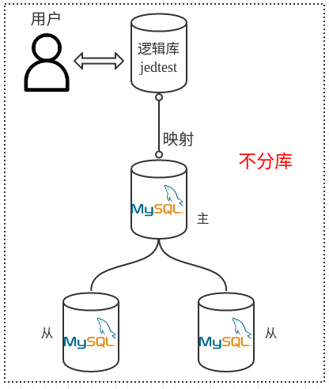
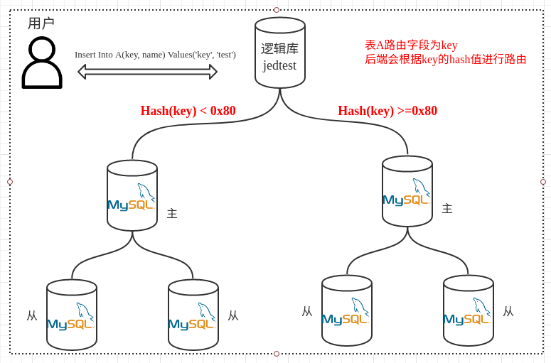
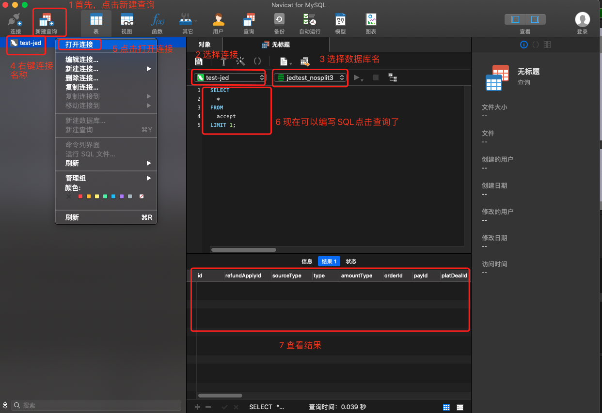

# FAQ

## JED中分库和不分库有什么区别? 

不分库和分库(2片)的情况下，逻辑库和后端实际库的对应关系如下图所示。用户访问时都是通过负载均衡访问逻辑库。




## JED 中拆分字段(路由字段)主要作用是什么？

JED 提供以分库的形式达到数据库的水平拆分， 拆分字段的主要作用就是用来对表数据进行水平拆分。比如用户老数据表A有1000万数据， 迁移到 JED 后分两片， 每个分片就会均匀的有500万数据。

这就需要使用表A的某一个字段(最好是唯一键，或者重复性较小的字段)，这样对拆分字段值做hash才能保证数据均匀分布在两个分片上； 

比如：A表的结构如下

```mysql
CREATE TABLE `A` (
  `id` int(11) NOT NULL AUTO_INCREMENT COMMENT '主键',
  `key` varchar(32) NOT NULL COMMENT '路由字段',
  `name` varchar(32) DEFAULT NULL COMMENT '姓名',
PRIMARY KEY (`id`)
) ENGINE=InnoDB DEFAULT CHARSET=utf8;
```



## JED支持分库分表吗？

JED不提供拆表的功能，由于JED是以分片(分库)的形式达到表的水平拆分的，因此应对数据量特别大的场景时，建议使用分片+分表的方式（业务代码实现）

分表可以维持单个表的数据量比较少，提升性能，另外做DDL时影响也小。200G的大表及20G的小表做DDL，对数据库的影响也是不一样的。

对于分片的场景，分表无需过多。一般控制逻辑库中表的数量在300以下即可，比如有15个逻辑表，每个逻辑表分16个表，总体有240个表。

## JED如何保证多个分片数据均匀？

JED基于hash算法完成数据的散落，可以在hash算法的保证下继续通过调节range的范围来达到数据的均匀，虽然是基于hash算法主要还是需要依赖业务拆分字段的具体数据，所以拆分字段的选择也非常关键。

## JED对拆分键（路由字段）的设置有什么限制吗？

- 拆分键不能使用自增主键；

- 对表名称大小写敏感，路由中字段的大小写必须和代码中表名称的大小写匹配，否则可能出现找不到路由的情况

## JED对SQL语法的支持情况如何？有什么限制吗

支持大部分查询语句，但不包括复杂的特殊SQL，像子查询、JOIN与聚合函数一起使用等操作。

**注意弹性数据库不支持外键，建表语句存在外键会导致建表失败。**

更多信息请参考[使用限制](../Introduction/Restrictions.md)

## JED能动态扩容吗？

JED支持动态再拆分，可以轻松完成分片再拆分；这个过程不需要业务研发修改任何代码。

## JED支持读写分离吗？

JED支持读写分离 ，但是读写分离不是程序自动根据SQL去同步，而是通过不同的账号来处理读写分离，比如xxx_rw用户是读写账号，xxx_rr用户是只读账号，读写账号访问主库，只读账号访问从库。

## JED支持的MySQL客户端有哪些？

(1) 推荐使用官方免费开源的MySQL WorkBench，下载地址：https://dev.mysql.com/downloads/file/?id=474219

(2) 支持Navicat，从官网下载即可，注意JED与原生MySQL有区别，所以使用navicat连接的方式有所不同，请按照下图所示操作：

- 配置数据库连接基本信息（主机用户名等信息修改成自己的库信息）


- 配置数据库列表


- 开始使用



## JED对JDBC的兼容性怎么样？有什么注意事项吗？

JED对JDBC协议的兼容性做了支持，但在使用时有以下几点需要注意：

(1) 目前支持的字符集设置为utf-8以及utf8mb4（默认字符集），如果设置其他字符集，系统将返回错误。

(2) 不支持`'SET SESSION ...'`数据库变量设置。

(3) 不支持事务隔离级别在线更改。

(4) 不使用SSL时，用户认证只支持NativePasswordPlugin方式，即com.mysql.jdbc.authentication.MysqlNativePasswordPlugin。

(5) 单次事务的有效时间默认为30s，如果达到该时间的事务仍未commit提交或rollback回滚，则系统将执行rollback回滚操作并返回错误信息。

(6) 设置autoReconnect=true，否则容易超时，dbcp连接池配置validationQuery和testOnBorrow属性，c3p0配置testConnectionOnCheckin和testConnectionOnCheckout属性。

(7) MySQL驱动目前不支持mysql-connector-java-5.1.18版本或者更早的版本，支持mysql-connector-java-5.1.30 版本，这是因为过低的版本可能会导致连接不成功。遇到此问题升级 jdbc 驱动版本即可。

## JED分库情况下，不提供拆分字段有何影响？

分库后建议查询都带拆分字段，否则会导致读放大；放大的倍数和分片的数量一致

不带拆分字段的sql会发送到全部的分片，响应时间是最慢的一个分片的响应时间；

业务不带拆分字段的sql如果并发量很大的话对后端数据库将是灾难。

所以请业务尽量查询中带拆分字段，如果实在没法带就需要减少该sql的访问频率，通过缓存方式控制查询频率

同理在分库情况下，发送了一个不带拆分字段的update语句，该语句会分片发送到后端每个分片进行处理。

## 服务已经运行好久了，一直没有问题，突然出现了`uncategorized SQLException for SQL`错误，并发量也较高

出现以上问题可能是访问量较高导致容器OOM了，出现OOM的原因一般是慢sql较多占用内存多，同时并发量也大

解决方法:

- 查看主库内存监控信息，看看内存是不是在故障时间点达到了100%又回落

- 查看数据库慢sql日志，根据慢日志信息进行优化

## 使用JED时经常碰到`Communications link failure`错误

出现这个错误后首先您需要确定两个场景

(1) 我线上第一次连接，启动程序就出现这个错误

如果是第一次使用出现这个问题，那么问题可能的原因就是程序就没有连接上数据库，可能原因是jdbc连接配置错了、没有配置默认端口3358、账号密码不对、数据库驱动版本太旧， 数据库驱动版本请参考上一条第(7)项。

(2) 我线上已经运行了一段时间，可以正常查询数据和写入数据

出现这个错误的原因是，连接空闲时间超过10分钟被JED主动关闭了，关闭之后JDBC连接池不知道当前连接已经被关闭，再次使用的时候就会出现`Communication link failure`的错误。

Jdbc可通过url连接数据库，以下配置仅供参考：

```
url=jdbc:mysql://{{domain}}:{{port}}/{{database}}?serverTimezone=Asia/Shanghai
spring.datasource.vitess.username={{username}}
spring.datasource.vitess.password={{password}}
spring.datasource.vitess.driver-class-name=com.mysql.jdbc.Driver
spring.datasource.vitess.minimum-idle=100
spring.datasource.vitess.maximum-pool-size=200
```

## 报错Aborted desc =transaction 1212132132432 : not found` 

该错误主要是业务逻辑中有大事务，JED 默认事务超时时间是30s，不建议延长该值，事务超时时间越长并发量大的时候死锁的可能性越大。
出现该问题建议业务优化业务逻辑，减少事务时间。

- Sql执行时间超过tablet中的事物超时时间设置（config-server-transaction-timeout）tablet会自动kill掉该事物。报killing transaction错误。

- Sql 执行时间超过了tablet中的sql执行时间设置（config-server-query-timeout）tablet会自动kill掉该协程。报killing query错误。

解决方法： 优先排查业务逻辑，解决嵌套事务和大事务问题；

**如果您十分确认您业务中没有大事务，还有一种可能就是您业务配置的autocommit=false，所有的操作都会默认走事务，您需要修改该值为true，使用事务的地方通过begin/commit/rollback显式方式处理即可**

## 报错`code = ResourceExhausted desc = transaction pool connection limit exceeded`

错误可能原因：

(1) 业务有大事务，导致事务连接池被长期占用，没有连接可以获取。或者机器负载太高io使用率太高导致响应延迟。

- 解决方法：业务排查；同时排查慢sql定位问题

(2) 主库磁盘写满，导致无法新建连接

- 解决方法：清理磁盘

## 报错`rpc error: code = DeadlineExceeded desc = Lost connection to MySQL server during query (errno 2013) (sqlstate HY000) during query: xxxxxxx`

出现这个错误是因为您执行了一个超级大的sql，sql执行时间超过300s，JED 有保护机制，对于超过查询超时时间的sql会自动kill掉。JED默认的查询超时时间是300s，如果查询超过300s会直接kill，防止影响其他业务； 如果出现该问题请您修改您的sql，保证在300s内能执行完成即可

不建议编写超过300s执行的sql，这样系统的吞吐量和性能会受到很大的影响。

## 报错：`rpc error: code = ResourceExhausted desc = grpc: received message larger than max (76820061 vs. 64554432)`

这个错误是因为一次性返回太多记录或者有大字段造成。

目前的限制是64M，防止返回太多记录，对网关造成影响，这个是对网关的保护，不能取消限制。

解决方法：

- 加上where条件（索引不要忘记，这样会减轻后端数据库的压力）、减少返回记录数，或者返回字段中不带大字段。

- 利用rs账号，进行流式查询；但流式查询，部分复杂语法支持不好。

## 使用后缀为rs的账号进行流式查询可以使用JOIN么？

不可以，报错 “Stream execute do not support join operation”。流式查询只支持简单的where过滤、排序、分组和分页查询，不能支持JOIN查询

## 报错`ERROR 1153 (08S01): in-memory row count exceeded allowed limit of 10000000`

JED对网关层返回的中间结果和最终结果集的行数在内存中限制1000W行，这种策略主要是考虑对底层MySQL的保护，建议还是尽量减少结果集的大小，避免错误的sql把数据库打挂，如必须要检索更多的行数，建议使用_rs账号流式查询;
