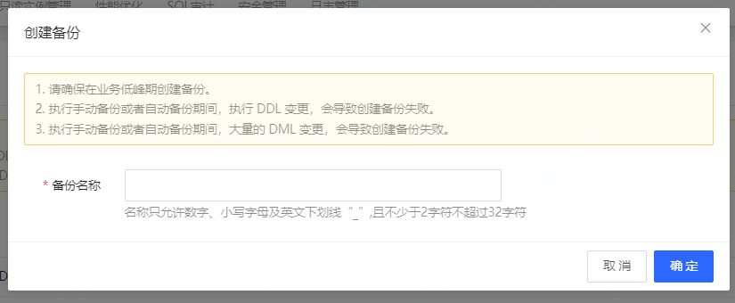

# PostgreSQL根据备份创建
云数据库 PostgreSQL 实例可以根据实例的备份，在同一个地域创建一个新实例。

## 注意事项 
* 新实例的规格不能小于备份所在源实例的规格
* 如果创建计费方式为按配置的资源，请确保您的账户余额（或代金券金额）不少于 50 元。

## 操作步骤
1. 登录 [云数据库 RDS 控制台](https://rds-console.jdcloud.com/database)。
2. 选择需要进行根据备份新建实例的目标实例，点击目标实例的名称，进入到实例详情页。
3. 点击 **备份管理** 标签，选择目标备份文件，点击操作列 **根据备份创建** 按钮点击，进入创建页面：

      
4. 实例配置的参数说明如下：  

    |参数|说明|
    |--|--|
    |地域|原实例所在地域，不支持修改|
    |数据库类型|原实例的数据库类型，不支持修改|
    |版本|不支持修改|
    |存储类型|不同的存储类对应的实例规格的最大IOPS不同, 请参考 [PostgreSQL 产品规格](../../../Introduction/Specifications/PostgreSQL-Specifications.md)。|
    |规格|新建实例的规格，需大于等于当前实例规格|
    |存储空间|存储空间包括数据空间、系统文件空间、Binlog文件空间和事务文件空间。|
    |网络类型|&bull; 在选择私有网络的时候，请确保需要连接数据库实例的云主机和数据库实例在同一个私有网络内。 &bull; 由于管理的需要，选择的子网保留若干剩余IP才允许创建实例。 &bull; MySQL, Percona, MariaDB：需要4个以上的剩余IP|
    |部署方式|支持单区域部署和多区域部署。 &bull; 多可用区部署：数据库主从分别位于不同的可用区，可用性更高：一个可用区发生故障，整个实例仍然可提供服务。 &bull; 单可用区部署：主从位于同一可用区，如果该可用区发生故障，整个实例无法对外提供服务。|
    |参数组|仅可选择与原实例相同参数组|
    |购买时长|如计费方式选择包年包月则需选择购买时长，可选择1个月至3年；购买的时长越长，折扣力度越大，具体以控制台为准。|

5. 点击 **立即购买** 进入订单确认页。
6. 阅读完云数据库 RDS 服务条款，按照提示完成后续操作.

## 相关API

根据备份创建：[createInstanceFromBackup](https://docs.jdcloud.com/cn/rds/api/createinstancefrombackup)