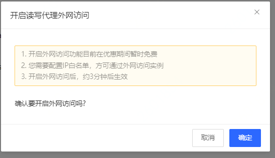

# 读写分离代理外网访问
配置读写分离代理的外网访问，从而可让应用服务的从外网访问数据库。

## 备注
- 默认情况下，外网访问关闭，出于安全考虑不建议开启外网访问。
- 开启外网访问前，请先设置白名单。
- 由于外网域名生效需要一定时间，请耐心等待3~5分钟。
- 如果关闭了外网访问，下次再次开启外网访问，访问地址会发生变化
- 目前开启外网访问功能暂不收费，产生的流量费用暂不收费

## 一、开启外网访问
1. 登录 [云数据库 RDS 控制台](https://rds-console.jdcloud.com/database)。
2. 选择需要开启读写代理外网访问的目标实例，点击目标实例的名称，进入到实例详情页。
3. 选择 **读写代理** 标签，打开读写代理管理页面。
4. 点击 **开启读写代理外网访问** 按钮，进入弹窗。

5. 在确认弹窗中，点击 **确定** 按钮。

6. 外网访问开启后，系统会自动分配一个外网域名地址。

## 二、关闭外网访问
1. 登录 [云数据库 RDS 控制台](https://rds-console.jdcloud.com/database)。
2. 选择需要关闭读写代理外网访问的目标实例，点击目标实例的名称，进入到实例详情页。
3. 选择 **读写代理** 标签，打开读写代理管理页面。
4. 点击 **关闭读写代理外网访问** 按钮，在确认弹窗中，点击 **确定** 按钮，关闭外网访问。

